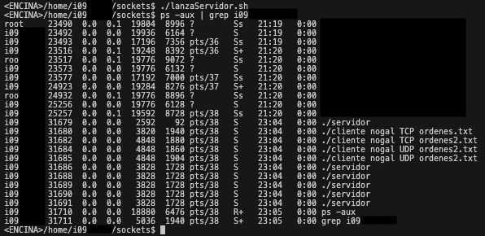

# Índice

- [Servidor](#servidor)
    - [Servidor TCP](#tcp)
        - [Inicialización del Socket y Configuración](#inicialización-del-socket-y-configuración)
        - [Manejo de Conexiones](#manejo-de-conexiones)
        - [Función `serverTCP`](#función-servertcp)
        - [Lógica de Juego y Respuestas](#lógica-de-juego-y-respuestas)
        - [Manejo de Errores y Cierre Ordenado](#manejo-de-errores-y-cierre-ordenado)
    - [Servidor UDP](#udp)
        - [Inicialización del Socket y Configuración](#inicialización-del-socket-y-configuración-1)
        - [Manejo de Conexiones](#manejo-de-conexiones-1)
        - [Función `serverUDP`](#función-serverudp)
        - [Lógica de Juego y Respuestas](#lógica-de-juego-y-respuestas-1)
        - [Manejo de Errores y Cierre Ordenado](#manejo-de-errores-y-cierre-ordenado-1)
- [Cliente](#cliente)
    - [Cliente TCP](#tcp-1)
        - [Inicialización del Cliente](#inicialización-del-cliente)
        - [Función `clienteTCP`](#función-clientetcp)
            - [1. Creación del Socket TCP](#1-creación-del-socket-tcp)
            - [2. Configuración de la Dirección del Servidor](#2-configuración-de-la-dirección-del-servidor)
            - [3. Conexión al Servidor](#3-conexión-al-servidor)
            - [4. Recepción del Mensaje de Bienvenida del Servidor](#4-recepción-del-mensaje-de-bienvenida-del-servidor)
            - [5. Bucle de Envío y Recepción de Datos](#5-bucle-de-envío-y-recepción-de-datos)
            - [6. Cierre de Recursos](#6-cierre-de-recursos)
    - [Cliente UDP](#udp-1)
        - [Inicialización del Cliente UDP](#inicialización-del-cliente-udp)
        - [Función `clienteUDP`](#función-clienteudp)
            - [1. Creación del Socket UDP](#1-creación-del-socket-udp)
            - [2. Configuración de la Dirección del Servidor](#2-configuración-de-la-dirección-del-servidor-1)
            - [3. Conexión "Falsa" y Recepción de Respuesta del Servidor](#3-conexión-falsa-y-recepción-de-respuesta-del-servidor)
            - [4. Envío y Recepción de Datos](#4-envío-y-recepción-de-datos)
            - [5. Cierre de Recursos](#5-cierre-de-recursos)
- [`socketsutils.c`](#socketsutilsc)
    - [Función `handler()`](#función-handler)
    - [Función `recibeUDPMejorado()`](#función-recibeudpmejorado)
- [Pruebas](#pruebas)


# Práctica de Nivel de Transporte (Sockets)

En esta práctica, implementamos un servidor que acepta conexiones tanto en TCP como en UDP, registrando las peticiones en un archivo de registro llamado `peticiones.log`. Además, se ha desarrollado un cliente capaz de interactuar con el servidor a través de ambos protocolos.

# Servidor

## TCP

### Inicialización del Socket y Configuración

El servidor comienza inicializando un socket TCP para aceptar conexiones. Aquí, se configuran la dirección y el puerto del servidor, y se realiza la vinculación del socket. Además, se establece un límite en la cola de conexiones pendientes mediante la función `listen`.

```c
ls_TCP = socket(AF_INET, SOCK_STREAM, 0);
if (ls_TCP == -1)
{
    perror(argv[0]);
    fprintf(stderr, "%s: unable to create socket TCP\n", argv[0]);
    exit(1);
}

memset((char *)&myaddr_in, 0, sizeof(struct sockaddr_in));
memset((char *)&clientaddr_in, 0, sizeof(struct sockaddr_in));

addrlen = sizeof(struct sockaddr_in);

myaddr_in.sin_family = AF_INET;
myaddr_in.sin_addr.s_addr = INADDR_ANY;
myaddr_in.sin_port = htons(PUERTO);

if (bind(ls_TCP, (const struct sockaddr *)&myaddr_in, sizeof(struct sockaddr_in)) == -1)
{
    perror(argv[0]);
    fprintf(stderr, "%s: unable to bind address TCP\n", argv[0]);
    exit(1);
}

if (listen(ls_TCP, 5) == -1)
{
    perror(argv[0]);
    fprintf(stderr, "%s: unable to listen on socket\n", argv[0]);
    exit(1);
}
```

### Manejo de Conexiones

El servidor utiliza el modelo de concurrencia basado en fork para manejar múltiples conexiones simultáneamente. Cada vez que se acepta una nueva conexión TCP, se crea un nuevo proceso hijo para manejar esa conexión. El proceso hijo cierra el socket de escucha y ejecuta la función `serverTCP` para gestionar la comunicación con el cliente.

```c
if (FD_ISSET(ls_TCP, &readmask))
{
    s_TCP = accept(ls_TCP, (struct sockaddr *)&clientaddr_in, &addrlen);
    if (s_TCP == -1)
        exit(1);

    switch (fork())
    {
    case -1: 
        exit(1);

    case 0: 
        close(ls_TCP);

        // Starts up the server
        serverTCP(s_TCP, clientaddr_in, myaddr_in);
        exit(0);

    default: 
        close(s_TCP);
    }
}
```

### Función `serverTCP`

La función `serverTCP` maneja la comunicación con un cliente TCP específico. Comienza enviando un mensaje de bienvenida al cliente y luego inicia un bucle para recibir y procesar las solicitudes del cliente.

Se envía un mensaje de bienvenida al cliente indicando que el servicio está listo:

```c
send(sock, "220 SERVICIO PREPARADO\r\n", sizeof("220 SERVICIO PREPARADO\r\n"), 0);
```

Se espera a recibir la respuesta del cliente. El bucle principal se inicia y continúa hasta que se recibe el comando "ADIOS" o hasta que se cumplan ciertas condiciones:

```c
recv(sock, buf, TAM_BUFFER, 0);
```

Dentro del bucle, se verifica si se recibió el comando "HOLA" o si es necesario enviar la siguiente pregunta. Dependiendo de la situación, se envían las respuestas correspondientes:

```c
while (1)
{
    recv(sock, buf, TAM_BUFFER, 0);

    if (esAdios(buf))
    {
        break;
    }

    if (strcmp(buf, HOLA) == 0 || next == 1)
    {
        // ...
    }
    else
    {
        // ...
    }
}
```

### Lógica de Juego y Respuestas

La función maneja la lógica del juego, generando preguntas aleatorias y evaluando las respuestas del cliente.

```c
char *lineofFileofQuestions;
char *respuesta = getAnswerFromIndex(index, matrizRespuestas);
// ... 

while (1)
{
    // Lógica para recibir y evaluar las respuestas del cliente
}
```

Se genera una pregunta aleatoria y se envía al cliente. Luego, se espera a recibir la respuesta del cliente y se evalúa si es correcta o incorrecta. El bucle continúa hasta que se recibe el comando "ADIOS" o hasta que se cumplen otras condiciones.

### Manejo de Errores y Cierre Ordenado

El código incluye manejo de errores, registro de eventos en un archivo de registro y cierre ordenado de sockets y procesos.

```c
close(s);
fclose(log);
```

Se cierra el archivo de registro al finalizar la comunicación con el cliente.


## UDP

### Inicialización del Socket y Configuración

El servidor UDP inicializa un socket para recibir datagramas. A continuación, se muestra el código correspondiente:

```c
int ls_UDP = socket(AF_INET, SOCK_DGRAM, 0);
if (ls_UDP == -1)
{
    perror(argv[0]);
    fprintf(stderr, "%s: unable to create socket UDP\n", argv[0]);
    exit(1);
}

memset((char *)&myaddr_in, 0, sizeof(struct sockaddr_in));

myaddr_in.sin_family = AF_INET;
myaddr_in.sin_addr.s_addr = INADDR_ANY;
myaddr_in.sin_port = htons(PUERTO_UDP);

if (bind(ls_UDP, (const struct sockaddr *)&myaddr_in, sizeof(struct sockaddr_in)) == -1)
{
    perror(argv[0]);
    fprintf(stderr, "%s: unable to bind address UDP\n", argv[0]);
    exit(1);
}
```

### Manejo de Conexiones

En nuestro caso hemos utilizado un `fork()` simulando lo visto en el apartado anterior, de esta manera creamos una conexión false UDP:

```c
/* As well as its done in TCP, a new thread is created for that false connection */
switch (fork())
{
	case -1:
		exit(1);

	case 0: /* Child process comes here. */
		/* Child doesnt need the listening socket */
	    close(ls_UDP);

		/* Sends a message to the client for him to know the new port for
		 * the false connection
		 */
		if (sendto(s_UDP, " ", 1, 0, (struct sockaddr *)&clientaddr_in, addrlen) == -1)
		{
			perror(argv[0]);
			fprintf(stderr, "%s: unable to send request to \"connect\" \n", argv[0]);
			exit(1);
		}

		// Starts up the server
		serverUDP(s_UDP, clientaddr_in, myaddr_in);

		exit(0);				
}
```

### Función `serverUDP`

La función `serverUDP` gestiona la comunicación con un cliente UDP específico. Comienza enviando un mensaje de bienvenida al cliente y luego inicia un bucle para recibir y procesar las solicitudes del cliente.

Se envía un mensaje de bienvenida al cliente indicando que el servicio está listo:

```c
sendto(socketUDP, "220 SERVICIO PREPARADO\r\n", sizeof("220 SERVICIO PREPARADO\r\n"), 0, (struct sockaddr *)&clientaddr_in, addrlen);
```

Se espera a recibir la respuesta del cliente. El bucle principal se inicia y continúa hasta que se recibe el comando "ADIOS" o hasta que se cumplan ciertas condiciones:

```c
recvfrom(socketUDP, buf, TAM_BUFFER, 0, (struct sockaddr *)&clientaddr_in, &addrlen);
```

Dentro del bucle, se verifica si se recibió el comando "HOLA" o si es necesario enviar la siguiente pregunta. Dependiendo de la situación, se envían las respuestas correspondientes:

```c
while (1)
{
    recvfrom(socketUDP, buf, TAM_BUFFER, 0, (struct sockaddr *)&clientaddr_in, &addrlen);

    if (strcmp(buf, "HOLA\r\n") == 0)
    {
        // ...
    }

    if (strcmp(buf, HOLA) == 0 || next == 1)
    {
        // ...
    }
}
```

### Lógica de Juego y Respuestas

La función maneja la lógica del juego, generando preguntas aleatorias y evaluando las respuestas del cliente.

```c
char *lineofFileofQuestions;
char *respuesta = getAnswerFromIndex(index, matrizRespuestas);
// ... 

while (1)
{
    // Lógica para recibir y evaluar las respuestas del cliente
}
```

Se genera una pregunta aleatoria y se envía al cliente. Luego, se espera a recibir la respuesta del cliente y se evalúa si es correcta o incorrecta. El bucle continúa hasta que se recibe el comando "ADIOS" o hasta que se cumplen otras condiciones.

### Manejo de Errores y Cierre Ordenado

El código incluye manejo de errores, registro de eventos en un archivo de registro y cierre ordenado de sockets.

```c
close(s);
fclose(log);
exit(0);
```

Se cierra el archivo de registro al finalizar la comunicación con el cliente.

# Cliente

## TCP

### Inicialización del Cliente

El programa cliente verifica los argumentos proporcionados para garantizar que se proporcionen el nombre del servidor, el protocolo de transporte (TCP o UDP), y el nombre del archivo. Luego, determina el protocolo y llama a la función correspondiente (`clienteTCP` o `clienteUDP`).

```c
int main(int argc, char *argv[])
{
    if (argc != 4)
    {
        // Imprime un mensaje de uso incorrecto y sale del programa
        exit(1);
    }

    if (strcasecmp(argv[2], "tcp") == 0)
    {
        clienteTCP(argv[0], argv[1], argv[2], argv[3]);
    }
    else if (strcasecmp(argv[2], "udp") == 0)
    {
        clienteUDP(argv[0], argv[1], argv[2], argv[3]);
    }

    return 0;
}
```

### Función `clienteTCP`

La función `clienteTCP` realiza las siguientes operaciones:

#### 1. Creación del Socket TCP

Se crea un socket TCP. Si hay un error, el programa imprime un mensaje y sale:

```c
s = socket(AF_INET, SOCK_STREAM, 0);
```

#### 2. Configuración de la Dirección del Servidor

Se configura la dirección del servidor utilizando la familia de direcciones IPv4 y se obtiene información del host mediante `getaddrinfo`:

```c
servaddr_in.sin_family = AF_INET;
// Obtención de información del host (getaddrinfo)
```

#### 3. Conexión al Servidor

El cliente intenta conectarse al servidor. Si hay un error, imprime un mensaje y sale:

```c
if (connect(s, (const struct sockaddr *)&servaddr_in, sizeof(struct sockaddr_in)) == -1)
{
    // Manejo de error en la conexión
    exit(1);
}
```

#### 4. Recepción del Mensaje de Bienvenida del Servidor

El cliente recibe el mensaje de bienvenida del servidor. Si hay un error, se incrementa el contador de intentos:

```c
if (recv(s, buf, TAM_BUFFER, 0) == -1)
{
    // Manejo de error en la recepción
    intentos++;
}
```

#### 5. Bucle de Envío y Recepción de Datos

El cliente entra en un bucle donde lee líneas del archivo y las envía al servidor. Luego, espera recibir datos del servidor:

```c
while (fgets(buf, TAM_BUFFER, fp) != NULL)
{
    // Envío de datos al servidor
    len = send(s, buf, TAM_BUFFER, 0);

    // Recepción de datos del servidor
    len = recv(s, buf, TAM_BUFFER, 0);

    // Resto del código...
}
```

#### 6. Cierre de Recursos

El cliente cierra el archivo, libera la memoria y cierra el socket al finalizar la comunicación:

```c
fclose(fp);
free(file);
close(s);
```

## UDP

El cliente UDP realiza operaciones similares al cliente TCP, pero con algunas diferencias notables debido a la naturaleza sin conexión de UDP. Aquí se detallan los aspectos más relevantes del código.

### Inicialización del Cliente UDP

La función `clienteUDP` inicia configurando un socket UDP y la dirección del servidor. A continuación, se describen las etapas clave de este proceso.

#### 1. Creación del Socket UDP

Se crea un socket UDP para la comunicación con el servidor:

```c
int s = socket(AF_INET, SOCK_DGRAM, 0);
if (s == -1)
{
    // Manejo de error en la creación del socket
    exit(1);
}
```

#### 2. Configuración de la Dirección del Servidor

La dirección del servidor se configura para establecer la conexión:

```c
memset((char *)&myaddr_in, 0, sizeof(struct sockaddr_in));
memset((char *)&servaddr_in, 0, sizeof(struct sockaddr_in));

myaddr_in.sin_family = AF_INET;
myaddr_in.sin_port = 0;
myaddr_in.sin_addr.s_addr = INADDR_ANY;

// Manejo de errores en la vinculación del socket
if (bind(s, (const struct sockaddr *)&myaddr_in, sizeof(struct sockaddr_in)) == -1)
{
    perror(program);
    fprintf(stderr, "%s: unable to bind socket\n", program);
    exit(1);
}
```

#### 3. Conexión "Falsa" y Recepción de Respuesta del Servidor

Se envía un mensaje "falso" al servidor para iniciar la comunicación y se espera la respuesta:

```c
if (sendto(s, "", 1, 0, (struct sockaddr *)&servaddr_in, addrlen) == -1)
{
    // Manejo de error en el envío del mensaje "falso"
    exit(1);
}

char packet[TAM_BUFFER];
// Espera la respuesta del servidor con el nuevo socket
if (-1 == recibeUDPMejorado(s, packet, TAM_BUFFER, 0, (struct sockaddr *)&servaddr_in, &addrlen))
{
    // Manejo de error en la recepción de la respuesta del servidor
    exit(1);
}
```

#### 4. Envío y Recepción de Datos

Se establece un bucle para leer líneas de un archivo y enviarlas al servidor, esperando después la respuesta del servidor:

```c
while (fgets(buf, TAM_BUFFER, fp) != NULL)
{
    // Envío de datos al servidor
    len = sendto(s, buf, TAM_BUFFER, 0, (struct sockaddr *)&servaddr_in, addrlen);

    // Recepción de datos del servidor
    recibeUDPMejorado(s, buf, TAM_BUFFER, 0, (struct sockaddr *)&servaddr_in, &addrlen);

    // ...
}
```

#### 5. Cierre de Recursos

Se cierra el socket y el archivo de registro al finalizar la comunicación:

```c
close(s);
fclose(log);
```

# `socketsutils.c`

El archivo contiene funciones relacionadas con la manipulación de archivos, manejo de señales, y operaciones de red. Las funciones que encontramos son:

- `char **readArchivoPreguntas(char *, int *)`
- `char **readArchivoRespuestas(char *)`
- `char *getRandomQuestion(char **, int *)`
- `char *getAnswerFromIndex(int, char **)`
- `int esAdios(char *)`
- `int createLog(char *)`
- `FILE *openLog(char *)`
- `char *getCurrentTimeStr()`
- `void errout(char *, FILE *)`

Las funciones destacadas son las siguientes:

## Función `handler()`

Esta función es el manejador de la señal de alarma. Abre el archivo de registro (`peticiones.log`), escribe un mensaje indicando que se recibió la alarma y luego cierra el archivo:

```c
void handler()
{
	FILE *log = openLog("peticiones.log");
	if(log == NULL){
		printf("Error al abrir el archivo de log\n");
		fflush(stdout);
		exit(1);
	} else {
		fprintf(log, "ALARMA RECIBIDA\n");
		fflush(log);
	}	
	fclose(log);
}
```

## Función `recibeUDPMejorado()`

Esta función mejora la recepción de datos UDP, reintenta un número máximo de veces (`MAX_ATTEMPTS`) en caso de timeout y registra los intentos y errores en el archivo de registro proporcionado:

```c
int recibeUDPMejorado(int s, void *buffer, FILE *logfile, size_t buffer_size, int flags, struct sockaddr *addr, socklen_t *addrlen)
{
    // ... 

    while (n_retry < MAX_ATTEMPTS)
    {
        // ... 

        if (len == -1)
        {
            if (errno == EINTR)
            {
                // ... 
            }
            else
            {
                // ... 
            }
        }
        else
        {
            alarm(0);
            return len;
        }
    }

    // ... 

    exit(1);
}
```


# Pruebas

En el archvio `Makefile` se han incluido varias directivas para facilitar algunas tareas:

```makefile
kill:
	killall -9 servidor

unlog:
	rm -f cliente.log peticiones.log
```

La directiva `kill` permite matar todos los procesos llamados `servidor` que se estén ejecutando en el sistema. La directiva `unlog` elimina los archivos de registro `cliente.log` y `peticiones.log`.

## Pruebas de funcionamiento

La práctica se ha subido a `nogal`, una vez subido se ha ejecutado la orden `make` para compilar el código. A continuación, se ha ejecutado el script `lanzaServidor.sh` para iniciar los diferentes procesos.

Haciendo uso del comando `ps -aux | grep i0922349` se puede comprobar que se han iniciado los procesos correspondientes:




El fichero `/ficheros_log/peticiones.log` contiene las peticiones realizadas por los clientes al servidor. En él encontramos las directivas de las diferentes pruebas realizadas. Veamos a continuación una pequeña previsualización de su contenido:

```log
===================================================================
STARTING LOG AT Tue Dec 12 15:12:15 2023
NUMERO DE LINEAS LEIDAS: 10
===================================================================
SERVER SENDING at Tue Dec 12 15:12:15 2023 on PORT 57210|nogal.fis.usal.es|0.0.0.0|TCP|220 SERVICIO PREPARADO
===================================================================
RECEIVED AT Tue Dec 12 15:12:15 2023|nogal.fis.usal.es|212.128.144.105|TCP|RESPUESTA 67

SERVER SENDING at Tue Dec 12 15:12:15 2023|nogal.fis.usal.es|0.0.0.0|TCP|500 Error de sintaxis
===================================================================
RECEIVED AT Tue Dec 12 15:12:15 2023|nogal.fis.usal.es|212.128.144.105|TCP|RESPUESTA 110

SERVER SENDING at Tue Dec 12 15:12:15 2023|nogal.fis.usal.es|0.0.0.0|TCP|500 Error de sintaxis
===================================================================
RECEIVED AT Tue Dec 12 15:12:15 2023|nogal.fis.usal.es|212.128.144.105|TCP|+

SERVER SENDING at Tue Dec 12 15:12:15 2023|nogal.fis.usal.es|0.0.0.0|TCP|500 Error de sintaxis
===================================================================
RECEIVED AT Tue Dec 12 15:12:15 2023|nogal.fis.usal.es|212.128.144.105|TCP|RESPUESTA 51

SERVER SENDING at Tue Dec 12 15:12:15 2023|nogal.fis.usal.es|0.0.0.0|TCP|500 Error de sintaxis
===================================================================
===================================================================
STARTING LOG AT Tue Dec 12 15:12:20 2023
NUMERO DE LINEAS LEIDAS: 10
===================================================================
SERVER SENDING at Tue Dec 12 15:12:20 2023 on PORT 41109|nogal.fis.usal.es|0.0.0.0|UDP|220 SERVICIO PREPARADO
===================================================================
RECEIVED HOLA at Tue Dec 12 15:12:20 2023|nogal.fis.usal.es|212.128.144.105|UDP|HOLA
===================================================================
SERVER SENDING at Tue Dec 12 15:12:20 2023|nogal.fis.usal.es|0.0.0.0|UDP|250 ¿Cuántos metros mide una pista de atletismo?#5
===================================================================

...
```

Para los ficheros de registro de cliente se ha implementado un nombre único y un cambio de nombre en el código de la siguiente forma:
    
```c
    char logfile[50];
    sprintf(logfile, "%d.log", ntohs(myaddr_in.sin_port));
    char newlog[50];

    FILE *log;
    log = openLog(logfile);
    if (log == NULL)
    {
        perror(program);
        fprintf(stderr, "%s: unable to open file %s\n", program, logfile);
        exit(1);
    }

    // ...

    fclose(log);

    sprintf(newlog, "cliente_%d.log", ntohs(myaddr_in.sin_port));
    if (rename(logfile, newlog) != 0) {
        perror(program);
        fprintf(stderr, "%s: unable to rename log file\n", program);
    }

    close(s);
    exit(0);
```

De esta manera, cada cliente tendrá un fichero de registro único con el nombre `cliente_<puertoefimero>.log`.

Veamos los diferentes ficheros generados en la ejecución del programa:

- `/ficheros_log/cliente_57222.log`: `./cliente nogal TCP ordenes.txt`

    ```log
    Connected to nogal on port 57222 at Tue Dec 12 15:12:13 2023
    SERVER SENDED 220 SERVICIO PREPARADO
    at nogal on PORT 57222
    CLIENT SENDED HOLA
    at nogal on PORT 57222
    SERVER SENDED 250 ¿Cuántos metros mide una pista de atletismo?#5
    at nogal on PORT 57222
    CLIENT SENDED no lo se
    at nogal on PORT 57222
    SERVER SENDED 500 Error de sintaxis#4
    at nogal on PORT 57222
    CLIENT SENDED 1
    at nogal on PORT 57222
    SERVER SENDED 500 Error de sintaxis#3
    at nogal on PORT 57222
    CLIENT SENDED ADIOS
    at nogal on PORT 57222
    SERVER SENDED ADIOS
    at nogal on PORT 57222
    Closing down on port 57222 at Tue Dec 12 15:12:27 2023
    ============================================================
    ```

- `/ficheros_log/cliente_57210.log`: `./cliente nogal TCP ordenes1.txt`

    ```log
    Connected to nogal on port 57210 at Tue Dec 12 15:12:13 2023
    SERVER SENDED 220 SERVICIO PREPARADO
    at nogal on PORT 57210
    CLIENT SENDED RESPUESTA 67
    at nogal on PORT 57210
    SERVER SENDED 500 Error de sintaxis at nogal on PORT 57210
    CLIENT SENDED RESPUESTA 110
    at nogal on PORT 57210
    SERVER SENDED 500 Error de sintaxis at nogal on PORT 57210
    CLIENT SENDED +
    at nogal on PORT 57210
    SERVER SENDED 500 Error de sintaxis at nogal on PORT 57210
    CLIENT SENDED RESPUESTA 51
    at nogal on PORT 57210
    SERVER SENDED 500 Error de sintaxis at nogal on PORT 57210
    CLIENT SENDED ADIOS
    at nogal on PORT 57210
    SERVER SENDED ADIOS
    at nogal on PORT 57210
    Closing down on port 57210 at Tue Dec 12 15:12:18 2023
    ============================================================

    ```

- `/ficheros_log/cliente_57198.log`: `./cliente nogal TCP ordenes2.txt`

    ```log
    Connected to nogal on port 57198 at Tue Dec 12 15:12:13 2023
    SERVER SENDED 220 SERVICIO PREPARADO
    at nogal on PORT 57198
    CLIENT SENDED HOLA
    at nogal on PORT 57198
    SERVER SENDED 250 ¿Cuántos metros mide una pista de atletismo?#5
    at nogal on PORT 57198
    CLIENT SENDED RESPUESTA no lo se
    at nogal on PORT 57198
    SERVER SENDED 500 Error de sintaxis#4
    at nogal on PORT 57198
    CLIENT SENDED RESPUESTA 67
    at nogal on PORT 57198
    SERVER SENDED 354 MENOR#3
    at nogal on PORT 57198
    CLIENT SENDED RESPUESTA 110
    at nogal on PORT 57198
    SERVER SENDED 354 MENOR#2
    at nogal on PORT 57198
    CLIENT SENDED RESPUESTA 220
    at nogal on PORT 57198
    SERVER SENDED 354 MENOR#1
    at nogal on PORT 57198
    CLIENT SENDED +
    at nogal on PORT 57198
    SERVER SENDED 345 INCREMENTADO 1 INTENTO
    at nogal on PORT 57198
    CLIENT SENDED RESPUESTA 51
    at nogal on PORT 57198
    SERVER SENDED 354 MENOR#1
    at nogal on PORT 57198
    CLIENT SENDED RESPUESTA 110
    at nogal on PORT 57198
    SERVER SENDED 354 MENOR#0
    at nogal on PORT 57198
    CLIENT SENDED RESPUESTA 554
    at nogal on PORT 57198
    SERVER SENDED 375 FALLO
    at nogal on PORT 57198
    Closing down on port 57198 at Tue Dec 12 15:12:24 2023
    ============================================================
    ```

- `/ficheros_log/cliente_35517.log`: `./cliente nogal UDP ordenes.txt`

    ```log
    Connected to nogal on port 35517 at Tue Dec 12 15:12:13 2023
    CLIENT SENDED HOLA
    at nogal on PORT 35517
    SERVER SENDED 250 ¿Cuántos metros mide una pista de atletismo?#5
    at nogal on PORT 35517
    CLIENT SENDED no lo se
    at nogal on PORT 35517
    SERVER SENDED 500 Error de sintaxis#4
    at nogal on PORT 35517
    CLIENT SENDED 1
    at nogal on PORT 35517
    SERVER SENDED 500 Error de sintaxis#3
    at nogal on PORT 35517
    CLIENT SENDED ADIOS
    at nogal on PORT 35517
    SERVER SENDED ADIOS
    at nogal on PORT 35517
    ```

- `/ficheros_log/cliente_33262.log`: `./cliente nogal UDP ordenes1.txt`

    ```log
    Connected to nogal on port 33262 at Tue Dec 12 15:12:13 2023
    CLIENT SENDED RESPUESTA 67
    at nogal on PORT 33262
    SERVER SENDED 500 Error de sintaxis at nogal on PORT 33262
    CLIENT SENDED RESPUESTA 110
    at nogal on PORT 33262
    SERVER SENDED 500 Error de sintaxis at nogal on PORT 33262
    CLIENT SENDED +
    at nogal on PORT 33262
    SERVER SENDED 500 Error de sintaxis at nogal on PORT 33262
    CLIENT SENDED RESPUESTA 51
    at nogal on PORT 33262
    SERVER SENDED 500 Error de sintaxis at nogal on PORT 33262
    CLIENT SENDED ADIOS
    at nogal on PORT 33262
    SERVER SENDED 500 Error de sintaxis at nogal on PORT 33262
    ```

- `/ficheros_log/cliente_41109.log`: `./cliente nogal UDP ordenes2.txt`

    ```log
    Connected to nogal on port 41109 at Tue Dec 12 15:12:13 2023
    CLIENT SENDED HOLA
    at nogal on PORT 41109
    SERVER SENDED 250 ¿Cuántos metros mide una pista de atletismo?#5
    at nogal on PORT 41109
    CLIENT SENDED RESPUESTA no lo se
    at nogal on PORT 41109
    SERVER SENDED 500 Error de sintaxis#4
    at nogal on PORT 41109
    CLIENT SENDED RESPUESTA 67
    at nogal on PORT 41109
    SERVER SENDED 354 MENOR#3
    at nogal on PORT 41109
    CLIENT SENDED RESPUESTA 110
    at nogal on PORT 41109
    SERVER SENDED 354 MENOR#2
    at nogal on PORT 41109
    CLIENT SENDED RESPUESTA 220
    at nogal on PORT 41109
    SERVER SENDED 354 MENOR#1
    at nogal on PORT 41109
    CLIENT SENDED +
    at nogal on PORT 41109
    SERVER SENDED 345 INCREMENTADO 1 INTENTO
    at nogal on PORT 41109
    CLIENT SENDED RESPUESTA 51
    at nogal on PORT 41109
    SERVER SENDED 354 MENOR#1
    at nogal on PORT 41109
    CLIENT SENDED RESPUESTA 110
    at nogal on PORT 41109
    SERVER SENDED 354 MENOR#0
    at nogal on PORT 41109
    CLIENT SENDED RESPUESTA 554
    at nogal on PORT 41109
    SERVER SENDED 375 FALLO
    at nogal on PORT 41109
    ```

## Prueba de Acierto

Para poder comprobar como se comporta la práctica cuando obtiene un acierto, se ha generado un archivo `ordenes3.txt` con la siguiente información:

```txt
HOLA
dd
RESPUESTA 1
2
3
2
2
2
ADIOS
```

La salida que obtenemos en el fichero `/ficheros_log/ordenes3/peticiones.log` es la siguiente:

```log
===================================================================
STARTING LOG AT Tue Dec 12 15:52:49 2023
NUMERO DE LINEAS LEIDAS: 10
===================================================================
SERVER SENDING at Tue Dec 12 15:52:49 2023 on PORT 57236|nogal.fis.usal.es|0.0.0.0|TCP|220 SERVICIO PREPARADO
===================================================================
RECEIVED HOLA at Tue Dec 12 15:52:49 2023|nogal.fis.usal.es|212.128.144.105|TCP|HOLA
===================================================================
SERVER SENDING at Tue Dec 12 15:52:49 2023|nogal.fis.usal.es|0.0.0.0|TCP|250 ¿Cuántos metros mide una pista de atletismo?#5
===================================================================
RECEIVED at Tue Dec 12 15:52:50 2023|nogal.fis.usal.es|212.128.144.105|TCP|dd
===================================================================
SERVER SENDING at Tue Dec 12 15:52:50 2023|nogal.fis.usal.es|0.0.0.0|TCP|500 Error de sintaxis#4
===================================================================
RECEIVED at Tue Dec 12 15:52:51 2023|nogal.fis.usal.es|212.128.144.105|TCP|RESPUESTA 1
===================================================================
SERVER SENDING at Tue Dec 12 15:52:51 2023|nogal.fis.usal.es|0.0.0.0|TCP|350 ACIERTO
===================================================================
SERVER SENDING at Tue Dec 12 15:52:51 2023|nogal.fis.usal.es|0.0.0.0|TCP|250 ¿Cuántos hoyos tiene un campo de golf?#4
===================================================================
RECEIVED at Tue Dec 12 15:52:52 2023|nogal.fis.usal.es|212.128.144.105|TCP|3
===================================================================
SERVER SENDING at Tue Dec 12 15:52:52 2023|nogal.fis.usal.es|0.0.0.0|TCP|500 Error de sintaxis#3
===================================================================
RECEIVED at Tue Dec 12 15:52:53 2023|nogal.fis.usal.es|212.128.144.105|TCP|2
===================================================================
SERVER SENDING at Tue Dec 12 15:52:53 2023|nogal.fis.usal.es|0.0.0.0|TCP|500 Error de sintaxis#2
===================================================================
RECEIVED at Tue Dec 12 15:52:54 2023|nogal.fis.usal.es|212.128.144.105|TCP|2
===================================================================
SERVER SENDING at Tue Dec 12 15:52:54 2023|nogal.fis.usal.es|0.0.0.0|TCP|500 Error de sintaxis#1
===================================================================
RECEIVED at Tue Dec 12 15:52:55 2023|nogal.fis.usal.es|212.128.144.105|TCP|2
===================================================================
SERVER SENDING at Tue Dec 12 15:52:55 2023|nogal.fis.usal.es|0.0.0.0|TCP|500 Error de sintaxis#0
===================================================================
SERVER SENDING at Tue Dec 12 15:52:55 2023|nogal.fis.usal.es|0.0.0.0|TCP|375 FALLO
===================================================================
STARTING LOG AT Tue Dec 12 15:53:02 2023
NUMERO DE LINEAS LEIDAS: 10
===================================================================
SERVER SENDING at Tue Dec 12 15:53:02 2023 on PORT 52211|nogal.fis.usal.es|0.0.0.0|UDP|220 SERVICIO PREPARADO
===================================================================
RECEIVED HOLA at Tue Dec 12 15:53:02 2023|nogal.fis.usal.es|212.128.144.105|UDP|HOLA
===================================================================
SERVER SENDING at Tue Dec 12 15:53:02 2023|nogal.fis.usal.es|0.0.0.0|UDP|250 ¿Cuántos metros mide una pista de atletismo?#5
===================================================================
RECEIVED at Tue Dec 12 15:53:03 2023|nogal.fis.usal.es|212.128.144.105|UDP|dd
===================================================================
SERVER SENDING at Tue Dec 12 15:53:03 2023|nogal.fis.usal.es|0.0.0.0|UDP|500 Error de sintaxis#4
===================================================================
RECEIVED at Tue Dec 12 15:53:04 2023|nogal.fis.usal.es|212.128.144.105|UDP|RESPUESTA 1
===================================================================
SERVER SENDING at Tue Dec 12 15:53:04 2023|nogal.fis.usal.es|0.0.0.0|UDP|350 ACIERTO
===================================================================
SERVER SENDING at Tue Dec 12 15:53:04 2023|nogal.fis.usal.es|0.0.0.0|UDP|250 ¿Cuántos hoyos tiene un campo de golf?#4
===================================================================
RECEIVED at Tue Dec 12 15:53:05 2023|nogal.fis.usal.es|212.128.144.105|UDP|3
===================================================================
SERVER SENDING at Tue Dec 12 15:53:05 2023|nogal.fis.usal.es|0.0.0.0|UDP|500 Error de sintaxis#3
===================================================================
RECEIVED at Tue Dec 12 15:53:06 2023|nogal.fis.usal.es|212.128.144.105|UDP|2
===================================================================
SERVER SENDING at Tue Dec 12 15:53:06 2023|nogal.fis.usal.es|0.0.0.0|UDP|500 Error de sintaxis#2
===================================================================
RECEIVED at Tue Dec 12 15:53:07 2023|nogal.fis.usal.es|212.128.144.105|UDP|2
===================================================================
SERVER SENDING at Tue Dec 12 15:53:07 2023|nogal.fis.usal.es|0.0.0.0|UDP|500 Error de sintaxis#1
===================================================================
RECEIVED at Tue Dec 12 15:53:08 2023|nogal.fis.usal.es|212.128.144.105|UDP|2
===================================================================
SERVER SENDING at Tue Dec 12 15:53:08 2023|nogal.fis.usal.es|0.0.0.0|UDP|500 Error de sintaxis#0
===================================================================
SERVER SENDING at Tue Dec 12 15:53:08 2023|nogal.fis.usal.es|0.0.0.0|UDP|375 FALLO
```


La salida que obtenemos en los diferentes ficheros de registro de cliente es la siguiente:

- `/ficheros_log/ordenes3/cliente_57236.log`: `./cliente nogal TCP ordenes3.txt`

    ```log
    Connected to nogal on port 57236 at Tue Dec 12 15:52:48 2023
    SERVER SENDED 220 SERVICIO PREPARADO
    at nogal on PORT 57236
    CLIENT SENDED HOLA
    at nogal on PORT 57236
    SERVER SENDED 250 ¿Cuántos metros mide una pista de atletismo?#5
    at nogal on PORT 57236
    CLIENT SENDED dd
    at nogal on PORT 57236
    SERVER SENDED 500 Error de sintaxis#4
    at nogal on PORT 57236
    CLIENT SENDED RESPUESTA 1
    at nogal on PORT 57236
    SERVER SENDED 350 ACIERTO
    at nogal on PORT 57236
    CLIENT SENDED 2
    at nogal on PORT 57236
    SERVER SENDED 250 ¿Cuántos hoyos tiene un campo de golf?#4
    at nogal on PORT 57236
    CLIENT SENDED 3
    at nogal on PORT 57236
    SERVER SENDED 500 Error de sintaxis#3
    at nogal on PORT 57236
    CLIENT SENDED 2
    at nogal on PORT 57236
    SERVER SENDED 500 Error de sintaxis#2
    at nogal on PORT 57236
    CLIENT SENDED 2
    at nogal on PORT 57236
    SERVER SENDED 500 Error de sintaxis#1
    at nogal on PORT 57236
    CLIENT SENDED 2
    at nogal on PORT 57236
    SERVER SENDED 500 Error de sintaxis#0
    at nogal on PORT 57236
    CLIENT SENDED ADIOS
    at nogal on PORT 57236
    SERVER SENDED 375 FALLO
    at nogal on PORT 57236
    Closing down on port 57236 at Tue Dec 12 15:52:58 2023
    ============================================================
    ```

- `/ficheros_log/ordenes3/cliente_52211.log`: `./cliente nogal UDP ordenes3.txt`

    ```log
    Connected to nogal on port 52211 at Tue Dec 12 15:52:57 2023
    CLIENT SENDED HOLA
    at nogal on PORT 52211
    SERVER SENDED 250 ¿Cuántos metros mide una pista de atletismo?#5
    at nogal on PORT 52211
    CLIENT SENDED dd
    at nogal on PORT 52211
    SERVER SENDED 500 Error de sintaxis#4
    at nogal on PORT 52211
    CLIENT SENDED RESPUESTA 1
    at nogal on PORT 52211
    SERVER SENDED 350 ACIERTO
    at nogal on PORT 52211
    CLIENT SENDED 2
    at nogal on PORT 52211
    SERVER SENDED 250 ¿Cuántos hoyos tiene un campo de golf?#4
    at nogal on PORT 52211
    CLIENT SENDED 3
    at nogal on PORT 52211
    SERVER SENDED 500 Error de sintaxis#3
    at nogal on PORT 52211
    CLIENT SENDED 2
    at nogal on PORT 52211
    SERVER SENDED 500 Error de sintaxis#2
    at nogal on PORT 52211
    CLIENT SENDED 2
    at nogal on PORT 52211
    SERVER SENDED 500 Error de sintaxis#1
    at nogal on PORT 52211
    CLIENT SENDED 2
    at nogal on PORT 52211
    SERVER SENDED 500 Error de sintaxis#0
    at nogal on PORT 52211
    CLIENT SENDED ADIOS
    at nogal on PORT 52211
    SERVER SENDED 375 FALLO
    at nogal on PORT 52211
    ```